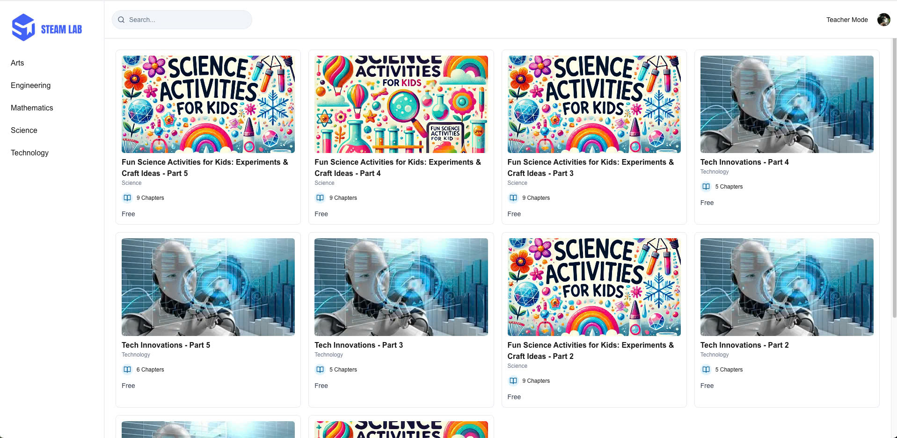

# 🌌 **STEAM LAB**


STEAM LAB is a dynamic Learning Management System designed specifically for elementary students & teachers to explore and engage with the diverse subjects of STEM. With a fun, interactive, and age-appropriate approach, STEAM LAB aims to inspire the next generation of young innovators and critical thinkers.

---

## 🗂 **Table of Contents**

- [🌌 STEAM LAB](#)
  - [🎬 Demo App](#demo-app)
  - [🗂 Table of Contents](#table-of-contents)
  - [🌍 About](#about)
  - [🚀 Features](#features)
    - [🪐 Authentication](#authentication)
    - [🧠 Courses Enroll](#courses-enroll)
    - [🧩 Course Creation](#courses-creation)
  - [📸 Screenshots](#screenshots)
  - [⚙️ Getting Started](#getting-started)
    - [🛠 Prerequisites](#prerequisites)
    - [📥 Installation](#installation)

---

## 🎬 **Demo App**

<div align="center">
  <video width="80%" controls>
    <source src="./public/demo/demo.mov"/>
  </video>
</div>

---

## 🚀 **Features**

### 🪐 **Authentication**

- **Sign In**: The **Sign In** page enables existing users to log into their accounts.

  - **Sign In with Google**: A button labeled "Continue with Google" allows users to sign in using their Google account.
  - **Email Sign In**: Users can also sign in using their email address.

- **Sign Up**: The **Sign Up** page allows new users to create an account.

  - **Sign Up with Google**: A button labeled "Continue with Google" allows users to register using their Google account.

  - **Email and Password Fields**: Users can sign up by entering an email address and a password.

### 🧠 **Courses Enroll**

The Courses Enroll feature for the STEAM program allows users to explore and enroll in a variety of educational courses in the fields of Science, Technology, Engineering, Arts, and Mathematics. Each course is designed to provide learners with engaging and interactive content that fosters both practical skills and creativity.

- **STEAM Categories**: The courses are divided into five main STEAM disciplines:
  - **Science**: Explore experiments, scientific activities, and lessons in physics, chemistry, and biology.
  - **Technology**: Dive into the world of cutting-edge technology, from AI and robotics to coding and cybersecurity.
  - **Engineering**: Learn about mechanical, civil, and electrical engineering principles and projects.
  - **Arts**: Integrate creativity with science and technology, focusing on design thinking, digital art, and more.
  - **Mathematics**: Enhance analytical skills and problem-solving through various mathematics-based courses.

### 🧩 **Course Creation**

The **Course Creation** feature empowers administrators, educators, or content creators to build and manage their own courses within the platform. This functionality is particularly designed to accommodate the wide range of subjects under the STEAM umbrella (Science, Technology, Engineering, Arts, and Mathematics), providing the tools necessary to deliver engaging and educational content for learners of all levels.

---

## 📸 **Screenshots**

<div align="center">
  
  
  
  
  
</div>

---

## ⚙️ **Getting Started**

### 🛠 **Prerequisites**

Make sure you have these tools installed before starting:

- **[Node.js](https://nodejs.org/en/)** (v18+)

### 📥 **Installation**

1. **Clone the repository**:

   ```bash
   git clone https://github.com/GuardianRisings/lms-template
   cd lms-template
   ```

2. **Install dependencies**:

   ```bash
   pnpm
   ```

3. **Start the app**:
    ```bash
    pnpm run dev
    ```
